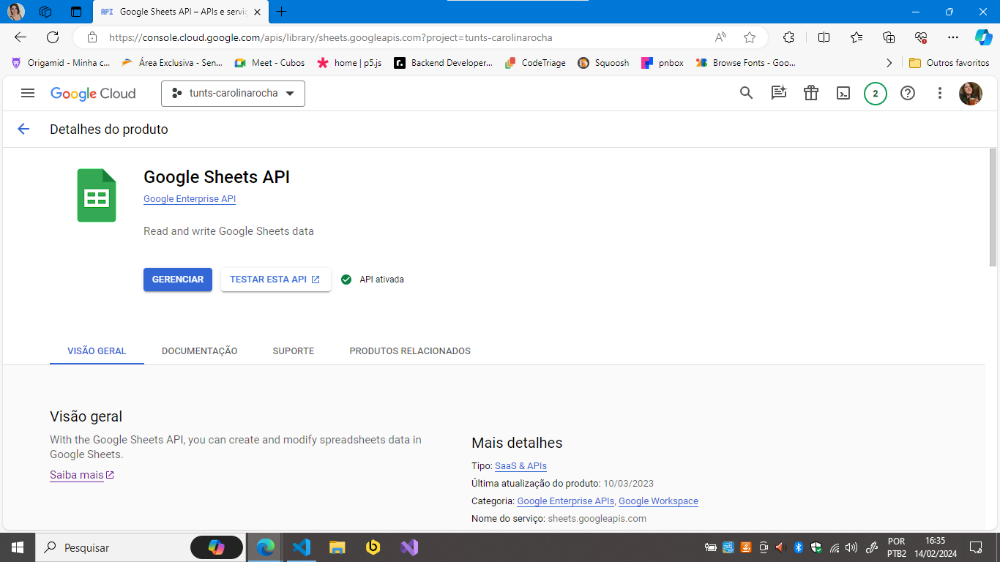
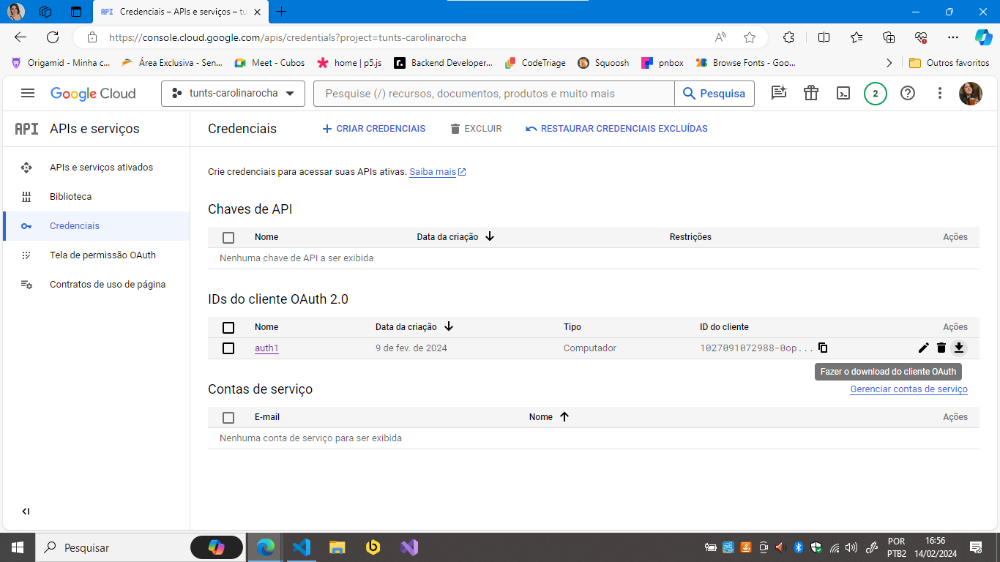

-   [Portugês](#aplicativo-em-nodejs)
-   [English](#console-application-in-nodejs)

# Aplicativo em node.js

Esse app foi desenvolvido para o Desafio Tunts.Rocks 2024 - vaga de estágio Dev Training em node.js, seguindo da documentação fornecida como referência e arquitetura modular, uma vez que se trata de uma aplicação simples.

### Planilha: <https://docs.google.com/spreadsheets/d/1g1McJwmlqukKte20fGJy8vkb_3kiEcni1IOVTLbA230/edit#gid=0>

## Credenciais

Neste projeto a autenticação do usuário Google é realizada localmente. Para rodar o aplicativo é preciso seguir os passos abaixo:

-   Criar um projeto no Google Cloud;
-   Na tela "APIs e serviços" ativar a API Google Sheets na biblioteca conforme a imagem abaixo:

-   Em "Tela de permissão OAuth" clique em criar, preencha os dados obrigatórios, insira o e-mail dos usuários de teste e clique em salvar.

-   Na tela "Credenciais" criar ID do cliente OAuth selecionando a opção "app para computador".

:exclamation: - Fazer download do arquivo criado e salvar na pasta **utils** do diretório do projeto com o nome **credentials.json**.

## Rodando o aplicativo

Após completar os passos acima, rode os seguintes comandos:

-   Instalar dependências: `npm i`

-   Script de execução: `npm run dev`

Caso seja o primeiro acesso, será aberta uma página de autenticação do Google. Após confirmar, o aplicativo criará o arquivo token.json e executará automaticamente a ação desejada na planilha.

# Console application in node.js

This app was developed for the Tunts.Rocks Challenge 2024 - Dev Training internship position in node.js, following the provided documentation as a reference and a modular architecture, considering it's a simple application.

## Spreadsheet: <https://docs.google.com/spreadsheets/d/1g1McJwmlqukKte20fGJy8vkb_3kiEcni1IOVTLbA230/edit#gid=0>

## Credentials

In this project, user authentication for Google is performed locally. To run the application, follow the steps below:

-   Create a project on Google Cloud.
-   On the "APIs & Services" screen, activate the Google Sheets API in the library as shown in the image below:

-   On the "OAuth consent screen" page, click create, fill in the mandatory information, enter the email addresses of the test users, and click save.

-   On the "Credentials" page, create an OAuth client ID by selecting the "Desktop app" option.

:exclamation: - Download the created file and save it in the utils folder of the project directory with the name credentials.json.

## Running the application

After completing the steps above, run the following commands:

-   Install dependencies: `npm i`

-   Execution script: `npm run dev`

If it's the first access, a Google authentication page will open. After confirmation, the application will create the token.json file and automatically perform the desired action on the spreadsheet.

